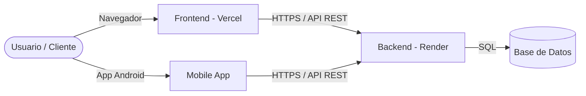

# 🏥 Hospital Vitae - Monorepo

[](https://laravel.com)
[](https://vuejs.org)
[](https://vitejs.dev)
[](https://developer.android.com)
[](https://vercel.com)
[](https://render.com)

Monorepo del sistema de **Hospital Vitae**, desarrollado para la materia de **Auditoría de Software (9no Semestre)**. Integra el Backend de servicios RESTful, la Plataforma Web cliente, la Aplicación Móvil nativa y colecciones de pruebas de API.

---

## 📁 Estructura del Monorepo

```text
hospital-vitae-monorepo/
├── 📄 README.md              # Documentación general del Monorepo
├── 📄 .gitignore             # Exclusiones globales de Git
├── 📂 vitae-backend/         # API RESTful en Laravel 12 (PHP 8.2+)
├── 📂 vitae-front/           # Aplicación Web en Vue 3 + Vite + TypeScript
├── 📂 vitae-mobile/          # Aplicación Móvil nativa Android (Kotlin)
└── 📂 vitae-bruno/           # Colección de pruebas de API con Bruno
```

---

## 🚀 Componentes del Proyecto

### 1. ⚙️ Backend (`vitae-backend`)
API principal encargada de la lógica de negocio, módulos de auditoría y almacenamiento de datos.
* **Tecnologías:** PHP 8.2+, Laravel 12, SQLite / PostgreSQL, Sanctum, Docker.
* **Despliegue:** Preparado para [Render](https://render.com/) mediante `Dockerfile` y `render.yaml`.

#### Configuración Local:
```bash
cd vitae-backend
composer install
cp .env.example .env
php artisan key:generate
php artisan migrate --seed
php artisan serve
```

---

### 2. 💻 Frontend Web (`vitae-front`)
Interfaz web de usuario moderna para la gestión de auditorías hospitalarias.
* **Tecnologías:** Vue.js 3, Vite, TypeScript, Vue Router.
* **Despliegue:** Configurado para [Vercel](https://vercel.com/).

#### Configuración Local:
```bash
cd vitae-front
npm install
npm run dev
```

#### Variables de Entorno en Vercel:
| Variable | Descripción | Ejemplo |
| :--- | :--- | :--- |
| `VITE_API_BASE_URL` | URL de la API Backend en Render | `https://vitae-backend.onrender.com/api` |

* **Configuración del proyecto en Vercel:**
  * **Root Directory:** `vitae-front`
  * **Framework Preset:** `Vite`
  * **Build Command:** `npm run build`
  * **Output Directory:** `dist`

---

### 3. 📱 Aplicación Móvil (`vitae-mobile`)
Cliente móvil nativo para Android.
* **Tecnologías:** Kotlin, Android SDK, Gradle KTS.

#### Compilación / Ejecución:
* Abrir el directorio `vitae-mobile` en **Android Studio**.
* Sincronizar Gradle y ejecutar en emulador o dispositivo físico.

---

### 4. 🧪 Colección de Pruebas API (`vitae-bruno`)
Colección de solicitudes HTTP estructuradas para auditar y probar la API.
* **Herramienta:** [Bruno API Client](https://www.usebruno.com/).
* **Uso:** Abrir Bruno y seleccionar la carpeta `vitae-bruno` para cargar todos los endpoints preconfigurados (GET, POST, PUT, DELETE).

---

## 🛠️ Despliegue en Producción



---

## ✒️ Licencia & Créditos

Proyecto desarrollado como parte del programa académico de **Ingeniería de Software - 9no Semestre**.  
* **Repositorio oficial:** [github.com/Coria322/hospital-vitae-monorepo](https://github.com/Coria322/hospital-vitae-monorepo)
